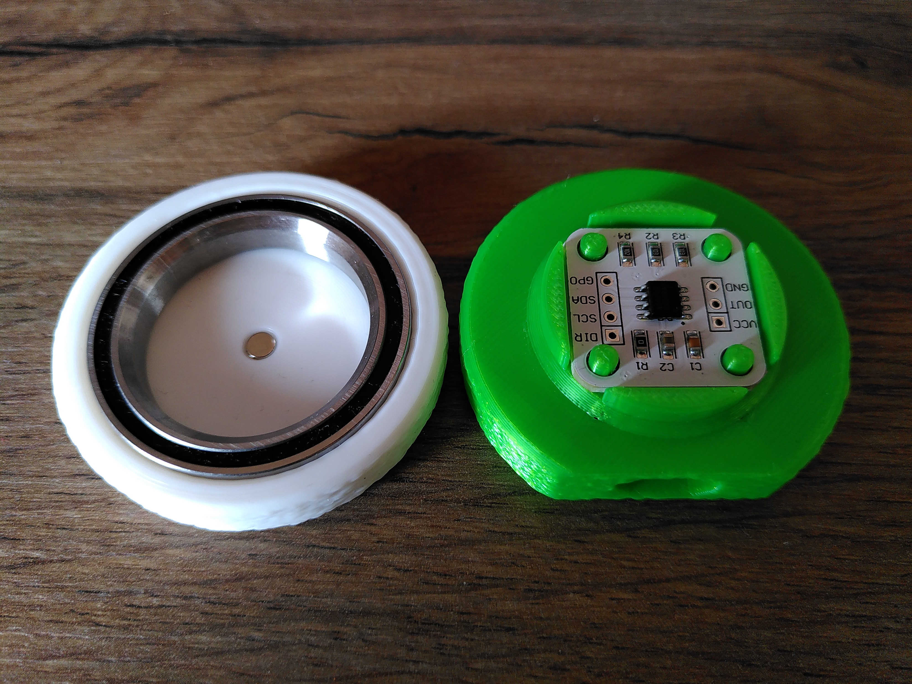
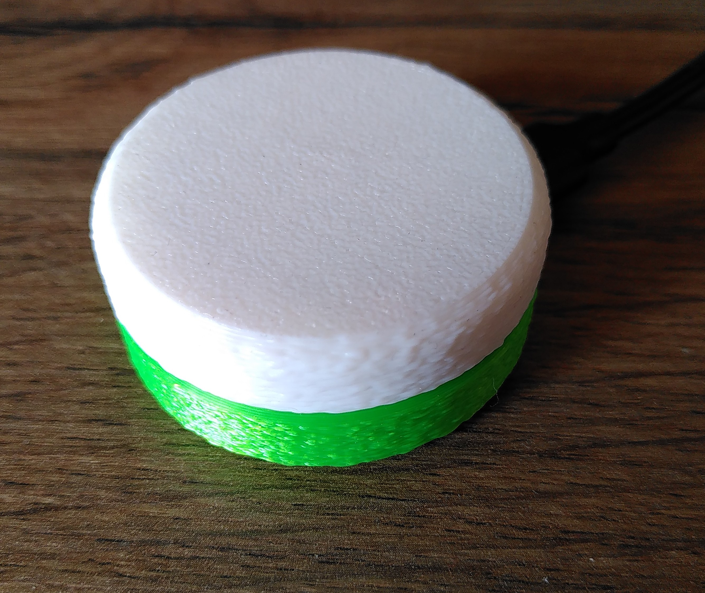

A high res scroll wheel inspired by the [ploopy knob](https://github.com/ploopyco/knob) \
Using micropython an a [RP2040-Zero](https://www.waveshare.com/wiki/RP2040-Zero) and either a AS5600 or MT6701 connected Pin 15 and 16.





USB lib from [micropython](https://docs.micropython.org/en/latest/library/machine.USBDevice.html) and [micropython-lib](https://github.com/micropython/micropython-lib/tree/master/micropython/usb) \
Descriptors based on [QMK](https://github.com/qmk/qmk_firmware/pull/24423/files#diff-9b81bdb526b5a64af607df29089326f9467bc3f12068661b20bc44bb6709d2f7R168) [QMK](https://github.com/eynsai/qmk_firmware/blob/b3a44e8e99787942e5d2f921ef449040ce3c9c4b/tmk_core/protocol/vusb/vusb.c#L527) and [HID-remapper](https://github.com/jfedor2/hid-remapper/blob/master/firmware/src/our_descriptor.cc#L82)

# Software
Tested in Linux

copy library files with:
``` bash
mpremote connect /dev/ttyACM0 cp -r lib :/
```
for AS5600
``` bash
mpremote connect /dev/ttyACM0 cp AS5600_main.py :/main.py
```

for MT6701
``` bash
mpremote connect /dev/ttyACM0 cp MT6701_main.py :/main.py
```

don't copy boot.py, it makes updating more difficult, its contents have been merged to the main files
``` bash
mpremote connect /dev/ttyACM0 cp boot.py :/
```

TODO:
- receive and evaluate feature report, currently report length is 0 bytes
 - Works fine without on Linux

# Body
3d/ contains the initial designfiles describing intenden geometry of the case \
3dprint/ contains data optimized for 3d printing with more tollerances, tested on a bambulab a1 mini with pla

[Bearing](aliexpress.com/item/1005007669751275.html)
